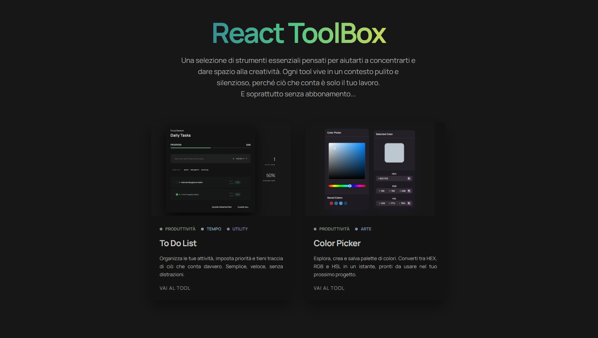

# React Toolbox

A personal project built to explore and deepen React skills through hands-on practice.
Each tool in this collection is a self-contained component built from scratch — no shortcuts.
New tools are added continuously as they get built.

## Documentation

In-depth implementation notes for the most interesting components are available in `src/docs`: [Color Picker Component docs](frontend/src/docs/ColorPickerComponent.md)


## Getting Started
```bash
# Clone the repository
git clone https://github.com/your-username/react-toolbox.git

# Navigate into the project
cd react-toolbox/frontend

# Install dependencies
npm install

# Start the development server
npm run dev
```


## Available Tools

| Tool | Status | Description |
|------|--------|-------------|
| Color Picker | ✅ Available | Full custom color picker — no default browser input used |
| TO-DO List | ✅ Available | Full custom to do list with built-in local storage based on cookies |
| Cronometer| ✅ Available | Custom cronometer with activity list and total focus time |

---

## Roadmap

- [X] To-Do List
- [X] Color Picker
- [X] Cronometer
- [ ] Color Palette Generator from a single color
- [ ] Typeface tester with font & size preview
- [ ] BMI Calculator
- [ ] Zone 2 Heart Rate Calculator
- [ ] Kanban Board
- [ ] And more...


## Future Plans

- **Flutter wrapper** — run the toolbox as a standalone desktop app
- **Docker support** — containerized deployment

---
